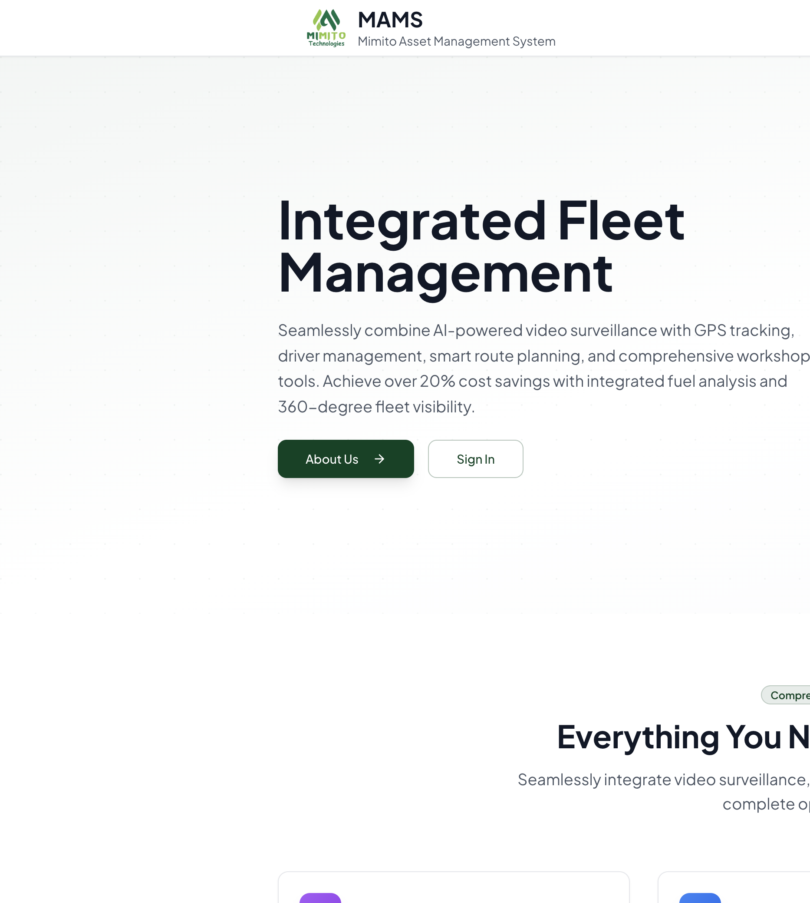

# MAMS User Manual

**Mimito Asset Management System**  
Version for platform release · July 2026  

This guide explains how to use **MAMS** from first sign-in through day-to-day operations on both the **Client portal** and the **Admin (platform) portal**.

---

## How to use this manual

| You are… | Start here |
|----------|------------|
| A **client** user (fleet operator, manager, admin) | [Part A — Getting started](#part-a--getting-started) → [Part B — Client portal](#part-b--client-portal) |
| A **platform / Mimito admin** | [Part A](#part-a--getting-started) → [Part C — Admin portal](#part-c--admin-portal) |
| Setting up a **new client** | [Part C · Clients](#31-clients-tenants) |

**Live system:** [https://mams.frontstardigital.com](https://mams.frontstardigital.com)  
**Login:** [https://mams.frontstardigital.com/auth/login](https://mams.frontstardigital.com/auth/login)

---

## Part A — Getting started

### A1. Open the platform

1. Open your browser (Chrome, Edge, or Safari recommended).
2. Go to the MAMS site.
3. On the landing page, click **Sign In**.

*Figure 1 — Public landing page with Sign In.*

### A2. Sign in

*Figure 2 — Login: media on the left, sign-in form on the right, Trusted by logos below.*

1. Enter your **Email** and **Password**.
2. Click **Sign In**.
3. You are taken to:
   - **Client portal** (`/app/...`) if you are a client user, or  
   - **Admin portal** (`/admin/...`) if you are a platform admin.

**Forgot password?** Use **Forgot password?** on the form, enter your email, then set a new password.

**Wialon Hosting:** If you also need the telematics console, use **Open Wialon Hosting** (opens `hosting.wialon.com` in a new tab). MAMS remains your day-to-day operations portal.

**Tips**

- Prefer desktop or tablet for maps and reports; the layout also works on phones.
- After a site update, if Print/PDF fails with a “module out of date” message, **refresh the page once** and try again.

### A3. Who sees what (roles)

#### Client (tenant) roles

| Role | Typical access |
|------|----------------|
| **Client Admin** (`tenant_admin`) | All enabled modules; can manage users under **Settings** |
| **Manager** | Most operational modules; write access where allowed |
| **Operator** | Dashboard, Monitoring, Alerts, Routes (and similar) — often read-focused |
| **Viewer** | Dashboard, Monitoring, Alerts — view only |

Your **left sidebar** only shows modules your organisation has enabled. If a module is missing, ask your Client Admin or Mimito support.

#### Platform (system) roles

| Role | Access |
|------|--------|
| **Super Admin** | Full admin portal including **System Users** |
| **Platform Admin** | Admin portal (clients, integrations, system settings) — not System Users |

---

## Part B — Client portal

After login you see your **client logo / name**, a **left sidebar**, and the main workspace. A **Live** indicator (when shown) means fleet data is refreshing.

### B1. Dashboard

**Path:** `/app/dashboard` · Sidebar: **Dashboard**

**What it is:** Overview of your fleet for a chosen date range — counts, fuel KPIs, alerts summary, and shortcuts into other modules.

**What to do**

1. Open **Dashboard**.
2. Set the **From / To** dates (or use the period controls).
3. Click **Execute** / apply so KPIs and charts refresh for that period.
4. Use tiles and charts to spot issues (fuel used, theft/sudden drops, alerts).
5. Use **Quick access** / module links to jump to Monitoring, Fuel, Alerts, etc.

**Accuracy tip:** Dashboard fuel totals use the **same fuel data** as the Fuel module for the same dates. Always apply the period before comparing numbers.

---

### B2. Monitoring

**Path:** `/app/monitoring` · Sidebar: **Monitoring**

**What it is:** Live map and asset detail for vehicles, generators, machinery, and other tracked units.

**Main views** (tabs / header):

| View | Purpose |
|------|---------|
| **Live Map** | Map of the fleet; click a unit for details |
| **Fleet List** | Searchable list (Running / Stopped / Offline filters) |
| **Track** | Playback a unit’s route for an interval |
| **Events** | Alerts / eco / video events linked to units |
| **Reports** | Monitoring-related report templates |

**Typical workflow — find an asset**

1. Open **Monitoring**.
2. Use **Search assets…** or the list filters.
3. Select the unit (e.g. a generator).
4. Review the detail panel:
   - Address / last update  
   - **Fuel**, engine hours, sats, etc.  
   - **Sensors** (named readings — use these day to day)  
   - Fuel tanks, custom fields, commands (if allowed)  
5. Use **Map**, **Track**, or **Commands** as needed.

**Note:** Raw **Live parameters** (technical IO codes) are hidden for client users. Use **Sensors** instead.

**Track workflow**

1. Select a unit → open **Track**.
2. Choose time interval → **Show track**.
3. Scrub playback to follow the route and sensor values along the trip.

---

### B3. Fuel

**Path:** `/app/fuel` · Sidebar: **Fuel**

**What it is:** Fuel levels, fillings, consumption, sudden drops, charts, costing, and **Wialon fuel reports**.

**Tabs** (when enabled for your account):

| Tab | Who it covers |
|-----|----------------|
| **Vehicles** | Road assets with fuel sensors |
| **Generators** | Gensets **and** stationary fuel storage such as **bowsers / tankers** (same FLS-style sensors) |
| **Machinery** | Plant / machinery (when configured) |
| **Reports** | Run fuel report templates (unit / group) |
| **Variance** | Station vs sensor fill comparison (when available) |

> **Important — URSB-style bowsers:** A **BOWSER** is a storage tank, not a road vehicle. It appears under **Generators** together with gensets. Sudden level drops on a bowser are treated as **dispensed** fuel where the system can detect that — not as theft.

#### Day-to-day fuel table

1. Open **Fuel** → the right category tab (e.g. Generators).
2. Set **Today / 7d / 14d / 30d** or custom **From / To**.
3. Click **Refresh** if data looks stale.
4. Use **Search** to find an asset.
5. Read columns: Filled, Used, Levels, Drops, Cost, etc.
6. Scroll to **Fuel charts** — they use the **same period and filter** as the table.
7. Set **Price per liter** under costing if you need money tiles (saved for dashboard charts too).

#### Run a fuel report (Wialon template)

1. Open **Fuel** → **Reports**.
2. Choose **Category** (or All modules).
3. Choose the **Report** template (e.g. Fuel Usage Report, Bowser Activity Report).
4. Choose **Unit** or **Group** (object type depends on the template).
5. Set **Period** (e.g. Custom dates) → **From** / **To**.
6. Click **Run report**.
7. Review result tabs:
   - Each **table** (Consumption, Fillings, Sudden Drops, …)  
   - **Fuel Graph** (when shown)  
   - Native **charts** from the template (when Wialon returns them)
8. Export:
   - **CSV (all tables)** — every table in one file when multiple tables exist  
   - **Download PDF** / **Print / PDF** — branded sheet with **all tables** and charts where available  

**If Print/PDF fails after a system update:** refresh the browser once, then retry.

---

### B4. Workshop

**Path:** `/app/workshop` · Sidebar: **Workshop**

**What it is:** Maintenance, inspections, breakdowns, and costing.

**Typical areas**

- Overview / KPIs  
- Inspections / checklists  
- Maintenance logs  
- Breakdowns  
- Costing & charts  
- Workshop reports  

**What to do:** Create or update maintenance and breakdown records against the correct asset; use costing views for period spend; export/print when you need a signed or archived copy.

---

### B5. Alerts

**Path:** `/app/alerts` · Sidebar: **Alerts**

**What it is:** Inbox of telematics and system alerts for your client.

**What to do**

1. Open **Alerts**.
2. Filter by severity / category / date if available.
3. Open an alert to see time, asset, and description.
4. **Acknowledge** alerts you have handled (multi-select when offered).
5. Use the reports sub-tab if your tenant has alert reporting enabled.

Alerts also appear in Monitoring → **Events**, matched to units when possible (including by asset id).

---

### B6. Other client modules (when enabled)

| Module | Path | Use it for |
|--------|------|------------|
| **Surveillance** | `/app/surveillance` | Cameras, live video, playback, video events |
| **Drivers** | `/app/drivers` | Driver roster and related reports |
| **Routes** | `/app/routes` | Route plans and tracking |
| **Geofencing** | `/app/geofencing` | Zones and zone reports |
| **Commands** | `/app/commands` | Remote device commands (roles that allow write) |
| **Trailers** | `/app/trailers` | Trailer roster |
| **Sensors** | `/app/sensors` | Live sensor views |
| **Emissions** | `/app/emissions` | CO₂ / sustainability views |

**Reports note:** There is no single global “Reports” menu. Each module has its own **Reports** area (Fuel reports are under Fuel → Reports).

---

### B7. Settings (client)

**Path:** `/app/settings` · Sidebar: **Settings**

| Tab | Who | What |
|-----|-----|------|
| **Account** | Everyone | Your profile / password (as offered) |
| **Users** | Client Admin+ | Create and manage users for this client |

Client branding (logo/colours) is configured by **platform admins**, not in client Settings.

---

### B8. Client portal checklist (daily)

1. Check **Dashboard** for the current period.  
2. Open **Monitoring** — confirm critical assets are online.  
3. Open **Fuel** — review fills, consumption, drops; refresh if needed.  
4. Open **Alerts** — acknowledge new items.  
5. Open **Workshop** if jobs or breakdowns are outstanding.  
6. Run any scheduled **Fuel → Reports** for management packs (CSV/PDF).

---

## Part C — Admin portal

**Path:** `/admin/...` · Only **Super Admin** and **Platform Admin**.

Left nav typically includes:

- Dashboard  
- Clients  
- Client Users  
- System Users *(Super Admin only)*  
- System  
- Integrations (marketplace)  
- Wialon Center / LocoNav Center / TrackSolid Center  
- Support  
- My Account  

### C1. Admin Dashboard

**Path:** `/admin/dashboard`

Platform health and overview. Use it to confirm services are operational before changing client config.

### C2. Clients (tenants)

**Path:** `/admin/tenants`

#### Create a client

1. Open **Clients** → **New client** (or `/admin/tenants/new`).
2. Enter name, slug, status, limits, manager as required.
3. Save, then open the client detail page.

#### Configure a client (`/admin/tenants/:id`)

Work through the tabs in order:

| Tab | What to do |
|-----|------------|
| **General** | Name, slug, status, limits, manager contact |
| **Integrations** | Attach Wialon (and/or LocoNav, TrackSolid) credentials / tokens for this client |
| **Branding** | Upload **logo** & **favicon**, set primary/secondary colours, optional CSS → **Save Branding** |
| **Modules** | Enable modules the client may use; control visibility in the sidebar |
| **Fuel Module** | Fuel-specific options for that tenant |
| **Users** | Client users and roles |
| **Migration / Backup / Audit / API Keys** | As needed for go-live and support |

**Recognition tip:** After linking Wialon, assets appear in the client portal under the right Fuel tabs (Vehicles / Generators / Machinery) based on sensors, groups, and naming. Stationary tanks named **bowser** / **fuel tanker** are grouped with **Generators**.

### C3. Client Users & System Users

- **Client Users** (`/admin/users`) — users across clients; assign tenant roles.  
- **System Users** (`/admin/system-users`) — Super Admin only; create platform admins.

### C4. System settings

**Path:** `/admin/system`

| Area | Purpose |
|------|---------|
| **General** | Platform-wide options |
| **Login media** | Login **slides** (images) and **Trusted by** logos |
| **Email / SMTP** | Outbound mail |
| **Webhooks** | Integrations callbacks |
| **Backup / Security** | Platform maintenance |

Login slides and trust logos appear on `/auth/login` for everyone (Figure 2).

### C5. Integration centers

| Center | Path | Use |
|--------|------|-----|
| **Integrations** marketplace | `/admin/marketplace` | Turn global plugins on/off |
| **Wialon Center** | `/admin/wialon` | Mother accounts, hierarchy, tenant linking, live checks |
| **LocoNav Center** | `/admin/loconav` | LocoNav operations |
| **TrackSolid Center** | `/admin/tracksolid` | TrackSolid operations |

### C6. Support & Account

- **Support** — onboarding steps and webhook URLs for implementation.  
- **My Account** — your admin profile.

### C7. New-client go-live checklist (admin)

1. Create client → set **General**.  
2. Connect **Wialon** (or other) under **Integrations**.  
3. Confirm assets appear (Wialon Center / client Monitoring).  
4. Enable **Modules** (Dashboard, Monitoring, Fuel, Alerts, Workshop, …).  
5. Set **Branding** (logo + colours).  
6. Configure **Fuel Module** if required.  
7. Create **Client Admin** user; verify login on client portal.  
8. Spot-check Fuel tabs (Vehicles / Generators / Machinery) and one **Fuel → Reports** run.  
9. Confirm login media under **System** if needed.  
10. Hand over credentials and this manual’s Part B.

---

## Part D — Reports, print & PDF (all portals)

1. Prefer **CSV** for spreadsheet analysis (Fuel reports can export **all tables**).  
2. Prefer **Download PDF** / **Print / PDF** for branded packs with tables and charts.  
3. Multi-table reports include **every table**, not only the active tab.  
4. Charts from Wialon templates appear as chart tabs/images when the template provides them.  
5. After a deployment, refresh once if a print chunk fails to load.

---

## Part E — Desktop, tablet & mobile

| Device | Guidance |
|--------|----------|
| **Desktop** | Best for maps, multi-table reports, admin config |
| **Tablet** | Full sidebar + map; use landscape for Monitoring |
| **Phone** | Login and alerts work well; for deep Fuel reports and Track playback, use a larger screen when possible |

The client shell keeps navigation, live status, and module content stacked cleanly on small screens; avoid zooming past browser defaults for tables.

---

## Part F — Troubleshooting

| Symptom | What to try |
|---------|-------------|
| Can’t sign in | Check email/password; use Forgot password; confirm account is active with admin |
| Module missing in sidebar | Module not enabled for client — ask Client Admin / platform admin |
| Empty Fuel table | Widen date range; click Refresh; confirm Wialon sync; check correct tab (Generators vs Vehicles) |
| Bowser under wrong tab | Should be under **Generators**; contact support if misclassified |
| Map empty | Confirm units online; refresh; check integration token |
| Print/PDF error | Hard refresh; retry; try CSV meanwhile |
| Numbers differ Dashboard vs Fuel | Apply the **same dates** and Execute/Refresh on both |

---

## Part G — Glossary

| Term | Meaning |
|------|---------|
| **MAMS** | Mimito Asset Management System |
| **Client / Tenant** | One customer organisation in MAMS |
| **Unit / Asset** | Tracked object (vehicle, generator, bowser, machinery, …) |
| **FLS** | Fuel level sensor |
| **Bowser** | Fuel storage tank / tanker — grouped with Generators in Fuel |
| **Wialon** | Telematics platform; MAMS runs many reports via Wialon templates |
| **Sudden drop** | Rapid fuel loss (often theft on vehicles; dispense on bowsers) |

---

## Document control

| Item | Detail |
|------|--------|
| Product | MAMS — Mimito Asset Management System |
| Audience | Client users & platform administrators |
| Screenshots | Live public pages (landing, login) · July 2026 |
| Maintained in | `docs/user-manual/` |

For features enabled only for your tenant, follow the labels in your own sidebar — module names match this manual even when some modules are hidden.

---

*© Mimito Technologies · MAMS User Manual*
